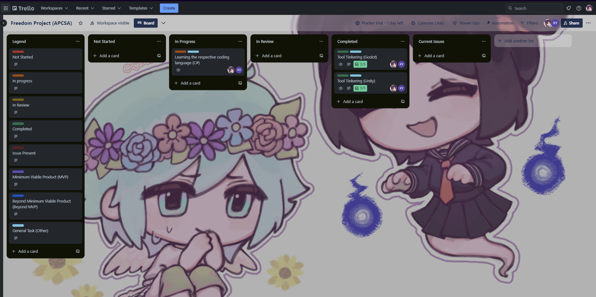

# Entry 1
Lets do this...two 11/11/2023

We are back! Back with a new chapter and a freedom project to create!

After the previous freedom project which was a major success, I plan to set the stakes higher for the next freedom project. Something unique from the rest of the freedom project, Something that people will enjoy.

Thats what I will set out to do. Since we are in APCSA, we get to create anything with any tool we wish. SEP11 was limited to javascript (but I chose to do an APCSA level project with permission from Mueller), but APCSA let us go wild. Its like you got access to a 5 star restaurants kitchen. You get to make whatever food you like.

Ok ok! Enough how ACPSA gave you the ultimate pass of freedom, what are you planning to do?

This year, I want to focus on creating a First Person Shooter game. I grew up with many First Person Shooters in my life such as Team Fortress 2, Left 4 Dead 2, Counter Strike, and Payday 2. There were other shooter games such as Splatoon 2 & 3 which is a third person chaotic paint game, but the feel of first person shooter games always brought be back playing them.

That is why my next projet is a first person shooter game. Also for this year I want someone to collaborate with. I believe with enough teamwork, we can combine our skills and create the best looking first person shooter game we could make. Luckily enough, [Xin Yan](https://github.com/xinyanh4701) shared similar interests in me and we decided to [collaborate](https://hstatsep.github.io/students/#skills) and work together.

After we decided to work together, we had to make sure that we need to get organized so we know what to do and which one will do it. I used the classic method of making a project board, similar to the last freedom project. Yep! This means I will be using Trello as my main board tool as it is consistantly reliable throughout my previous freedom project. Collaborating is one thing but [Organization](https://hstatsep.github.io/students/#skills) is key to success and [Time management](https://hstatsep.github.io/students/#skills) is another.

After setting up Trello, we went on to deciding which tool should be our main tool. We researched using google and came up with 5 engines we can use.

* Unity (C#)
* Godot (C# , C++)
* Roblox (Lua)
* Cry Engine (C# , C++ , Lua)
* Unreal Engine (C++)

We ultimately decided to use Unity as Unity provided excellent documentation with people who want to start with their program. Unlike the other engines documentation, unity makes it like a mini lesson and teaches you step by step in the documentation. This was the first. Usually with game engines in my experience, I would have to find a good youtube video tutorial to start. With Unity, I don't feel like I need an external source in order for me to get comfortable with the engine. It is essentially plug and play.

But how did I determine which game engine was suit for me? To find out, I based it on a couple of things...

* How easy it is to put a simple shape and modifying it
* How was the documentation
* What coding language do they use
* How user friendly was it

Sadly with the limited time we had, we have to skip out on Unreal Engine, Cry Engine , and Roblox. Unreal Engine was the obvious odd one out as it is not very beginner friendly and it uses the most difficult coding language which is C++. The other engines were skipped mainly because of time issues.

[Next](entry02.md)

[Home](../README.md)