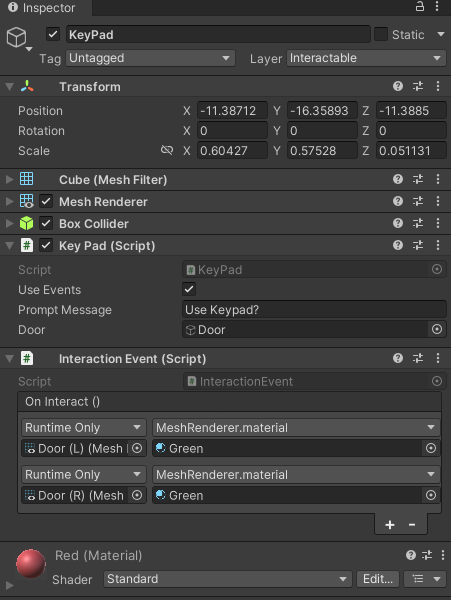
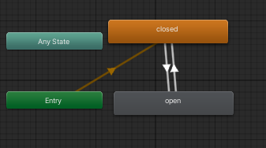

# Entry 3
A slow progress, but manageable. 2/9/2024

Wow, this month was slow. Most of our time between me and Xin Yan were mostly allocated for school work instead of the freedom project. Not to mention all the college related tasks that we have to keep tabs on. Due to this, expect this entry to be shorter than the rest.

I was able to create an interactable door using the scripts provided in [Video 2.5](https://www.youtube.com/watch?v=_UIiwzfZoZA&list=PLGUw8UNswJEOv8c5ZcoHarbON6mIEUFBC&index=3) of Natty's Gamedev video. Using the code below...

```cs
using System.Collections;
using System.Collections.Generic;
using UnityEngine;

public class KeyPad : Interactable
{
    [SerializeField]
    private GameObject door;
    private bool doorOpen;
    // Start is called before the first frame update
    void Start()
    {

    }

    // Update is called once per frame
    void Update()
    {

    }
    // This is where we design our interaction using code
    protected override void Interact(){
        // base.Interact();
        doorOpen = !doorOpen;
        Debug.Log(doorOpen);
        door.GetComponent<Animator>().SetBool("isOpen", doorOpen);
    }
}
```

This script is placed into our interactable. In this case, we will be using a red keypad to open our very big door.



Now we have the keypad interactable, but we can only interact with it. What will happen if we interact it. Thats where we need to create another script which you may have seen in the image above. We need to create a script on what will happen when the interactable gets interacted. We will be using of course our script file, but we will be also using the animation editor.

Now our interaction event script is a bit short because it is directly linked to the **interactable** script we have later on.

```cs
using UnityEngine.Events;
using UnityEngine;

public class InteractionEvent : MonoBehaviour
{
    public UnityEvent OnInteract;
}

```

Our interactable script looks like this

```cs
using System.Collections;
using System.Collections.Generic;
using UnityEngine;

public abstract class Interactable : MonoBehaviour
{
    // Add or remove an interaction event component to this game object.
    public bool useEvents;
    // Msg displayed to player when looking at interactable
    public string promptMessage;

    // This function will be called from our player
    public void BaseInteract(){
        if(useEvents){
            GetComponent<InteractionEvent>().OnInteract.Invoke();
        }
        Interact();
    }
    protected virtual void Interact(){
        // No code is written in this function. It is going to get overwritten by subclasses.
    }
}

```
These 2 script files will set us for for animating our door. Once we have these set up and placed into our keypad, we want to now animate our door. Before we animate, we need to declare the door as the interactable object to the keypad so it knows what to target.

After we done that, its time to get into animating. I'm not sure how you would describe it but it is basically building blocks.



The best way to describe this animation is that the door will default to close. Then once the event is triggered, it will swap between open and closed based on which is active. You can see this indicated by the arrows. I will try to experiement with this later on.

And that was pretty much it. That was the only addition to the freedom project. By the time I finished the door model and scripting, we've reached the deadline for the sample project. Me and Xin Yan decided to merge the 2 sample projects into one. By doing this, we created a repo that me and Xin Yan will use to collaborate together.

Now you may be asking why are you creating another repo when I could use my repo that has the writeups? It is because of the **.gitignore** file upon starting a fresh new repo. When starting a new repository, we are given a choice to add a **.gitignore** file if we want to. I do not know what it does, but it is vital because I cannot add the project folders into a repo and call it a day. It will not allow us to stage the files until we add the **.gitignore** file. I've learned this from this [video](https://youtu.be/qpXxcvS-g3g) I searched on youtube.

After that was done and some a little bit of testing, it works! Now that the repo was setup, we planned base on what we should do next. We decided that Xin Yan would work on the enemy AI while I work on the map and part of the AI scripting.

## EDP and Skills

I am gonna put EDP and Skills in the same section cause there isn't much to talk about.

Right now for our EDP, we are currently [Planning the most promising solution](https://hstatsep.github.io/students/#edp) but I don't think we are on the stage yet. We are starting to create a promising solution but we may have to stick with [Brainstorming possible solutions](https://hstatsep.github.io/students/#edp) as we need to plan out what we want to do. But still, we are making progress but I hope it goes fast by the months goes by.

As for skills, there are no new skills being learnt thoughout the month. Instead, I want to dedicate this for potential skills that I want to improve on and hope to strive for.

Even though this is a 2 person team, I still need to improve on [leadership](https://hstatsep.github.io/students/#skills). There are some times that we definitely slacked off on but I think with enough leadership, we can make our deadlines.

A second skill that I want to improve is [Communication](https://hstatsep.github.io/students/#skills). I think me and Xin Yan are not communicating well enough. This is especially true outside of school days where are only contact is on discord. I think keeping a active presence for me and Xin Yan should help with this. Maybe we have daily checkups in school? Who knows?

Anyways, that is it. See ya!


[Previous](entry02.md) | [Next](entry04.md)

[Home](../README.md)