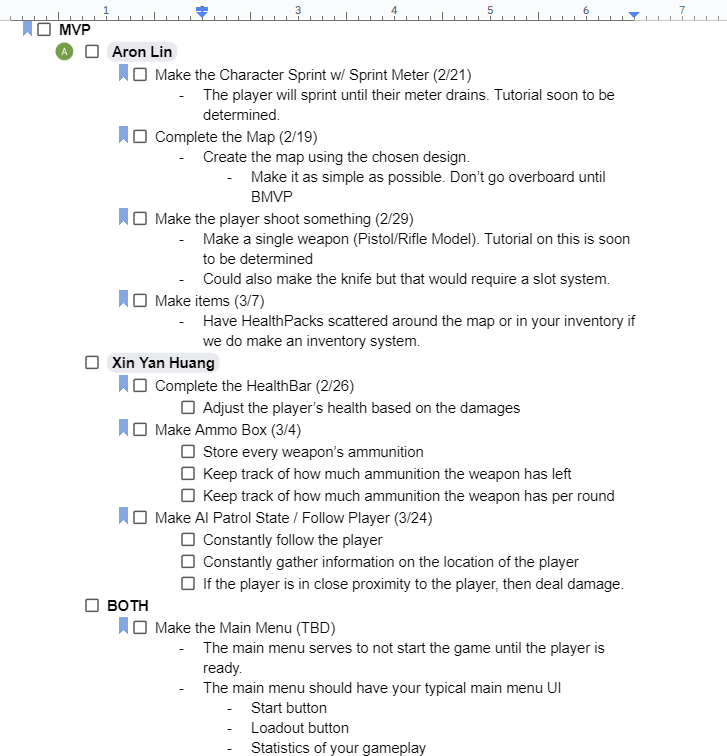
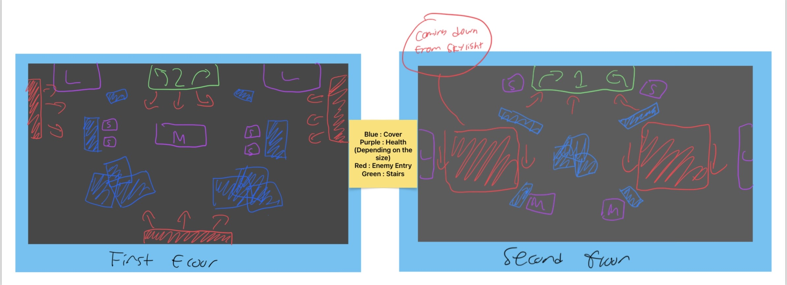
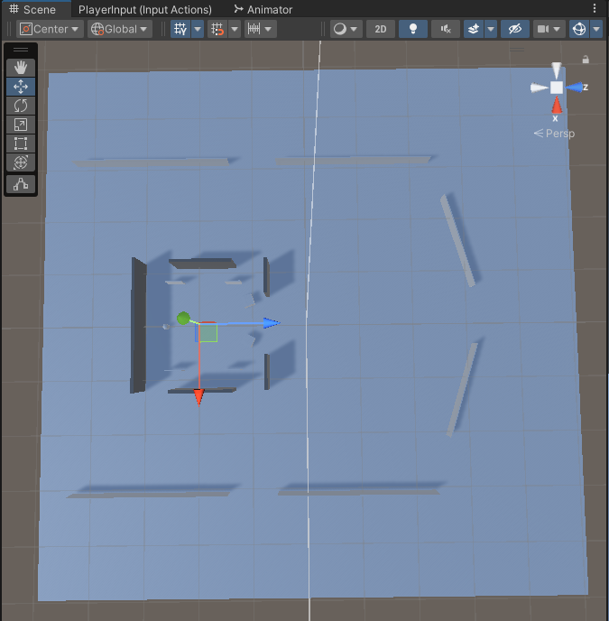

# Entry 4
Picking up the pace 3/11/2024

Me and Xin Yan are back and picking up the pace here! Most of our schoolwork is now managable and we can spend most of our time working towards our freedom project. Goes to show how little schoolwork could mean wonders to working on our project ey? Alright alright, you're here on some of our progress we made. Well we did!

Now, we did have to basically scrap most of the stuiff we did previously in favor of a better plan. This is because Mueller gave us a little wiggle room to start our actually MVP plan. This allowed us to lay out what was needed in order to create a minimally viable product. This was first created in a google doc before being transferred to the trello board.

**Google Doc**

**Trello board**

Over the next couple of days, we refined our MVP plan and decide what are we gonna do beyond the MVP stage. When we reached a conclusion on what are we gonna do, we were off to complete our tasks at hand.

My first step was to redesign the map. Throughout this blog, you will see mostly modeling isntead of coding but there will be coding parts in a bit. I want to redesign the map so that it could have a little bit of dynamic to it. I still want to keep the big holdout area in the middle so I made 2 sketches of what the map can potentially look like.

Me and Xin Yan decided we should go for the second one and that is what exactly I started working on.

This was the progress I was making. It took me a couple of days but I managed to build the final map. 

[Previous](entry03.md) | [Next](entry05.md)

[Home](../README.md)