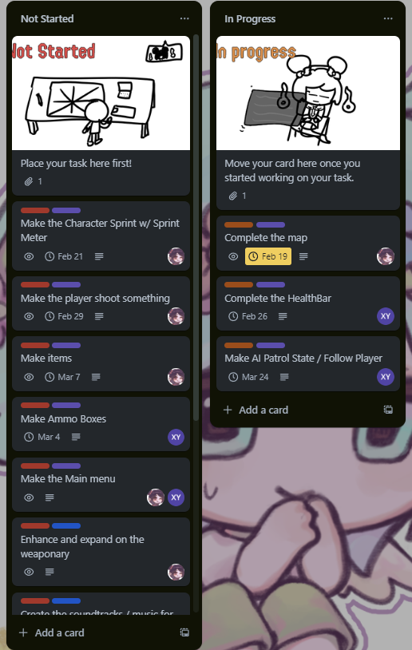

# Entry 4
Picking up the pace 3/11/2024

Me and Xin Yan are back and picking up the pace here! Most of our schoolwork is now managable and we can spend most of our time working towards our freedom project. Goes to show how little schoolwork could mean wonders to working on our project ey? Alright alright, you're here on some of our progress we made. Well we did!

Now, we did have to basically scrap most of the stuiff we did previously in favor of a better plan. This is because Mueller gave us a little wiggle room to start our actually MVP plan. This allowed us to lay out what was needed in order to create a minimally viable product. This was first created in a google doc before being transferred to the trello board.

**Google Doc**


**Trello board**



Over the next couple of days, we refined our MVP plan and decide what are we gonna do beyond the MVP stage. When we reached a conclusion on what are we gonna do, we were off to complete our tasks at hand.

My first step was to redesign the map. Throughout this blog, you will see mostly modeling isntead of coding but there will be coding parts in a bit. I want to redesign the map so that it could have a little bit of dynamic to it. I still want to keep the big holdout area in the middle so I made 2 sketches of what the map can potentially look like.


Me and Xin Yan decided we should go for the second one and that is what exactly I started working on.


This was the progress I was making. It took me a couple of days but I managed to build the final map.


Now that the final map was done, it was time to make the player the ability to sprint. Using our beloved [Natty's Gamedev Tutorial](https://www.youtube.com/watch?v=rJqP5EesxLk&list=PLGUw8UNswJEOv8c5ZcoHarbON6mIEUFBC), we were able to create the sprint functionality. However, there was a problem with the sprint functionality. It is press to sprint. What this means is that if the player presses the sprint button, the character would contantly sprint until the key is pressed down again. While this was fine, it was certainly unintuitive cause most gamers are used to the regular sprint functionality.

The regular sprint functionality is where the player would hold down the key in order to continue sprinting. Once the key is let go, the player will stop spritning. I want to try to replicate this functionality so I went to Google for answers. I stumbled across the [Unity documentation page](https://docs.unity3d.com/ScriptReference/Input.GetKey.html) to noticed that there was a key detection code, just like the one in javascript.

With this information, I got into coding. To make sure it was constantly updating, I put the code in the update method. This method will constantly run and repeat whatever you put in this code. Think of it like a never ending while loop.

```cs
    void Update()
    {
        isGrounded = controller.isGrounded;
        if(sprinting){
            if(Input.GetKey(KeyCode.LeftShift)){
                speed = 10f;
            } else {
                speed = 5f;
                sprinting = false;
            }
        }
    }
    // ...

    public void Sprint(){
        sprinting = !sprinting;
    }
```

Once sprint was added, it was time to make the player the ability to shoot the gun. This sadly took a long time due to me catching a sore throat but I was able to make some slight progress.

I wanted to experiement with the modeling so I want to this completely using whatever I have in the Unity editor. I spend some hours on it and the first model went surprisingly well.


Later that day, I added some dynamic to the model so it doesn't look like lego blocks being slapped onto a what appears to be a gun.


I had fun with this. It reminded me of my javascript days where we would play around with P5JS and create really wacky stuff. Neitherless, I managed to complete the gun model. I'm still working on coding but that will be on the next blog!

## EDP and Skills

In our last entry, we were on [planning the most promising solution](https://hstatsep.github.io/students/#edp) for our freedom project. Now I'm glad to say we are on a steady workflow to [create a prototype](https://hstatsep.github.io/students/#edp). We have to manage our time well as we don't have a lot of time but we should be able to get the prototype soon enough.

Now about our skills. I've mentioned before that I need to work on my [leadership](https://hstatsep.github.io/students/#skills) skills and that I need to [communicate](https://hstatsep.github.io/students/#skills) with my teammate more. Looking from back then to now, I have improved a lot. My leadership skills allowed me and Xin Yan to handle the deadlines well. On top of that, we were communicating a lot now compared to before it was barely existing. With the next blog entry, I hope to expand on these skills a lot more. 

[Previous](entry03.md) | [Next](entry05.md)

[Home](../README.md)