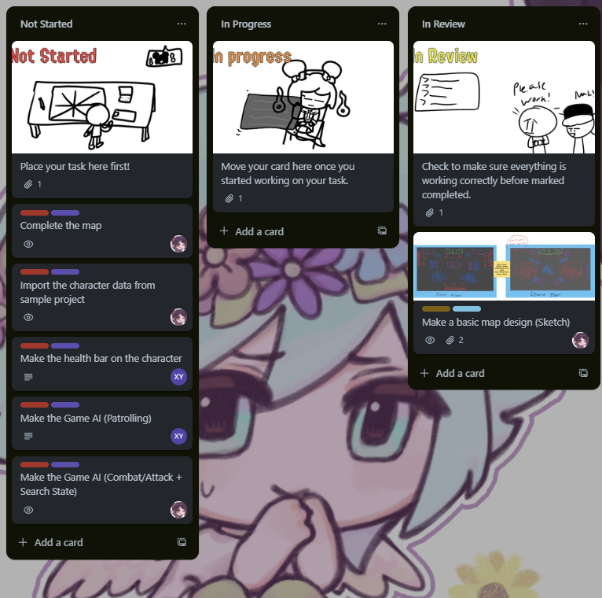
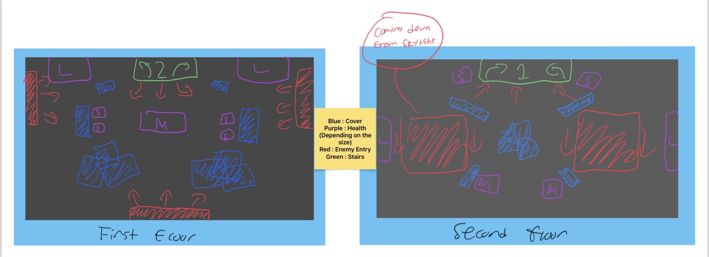
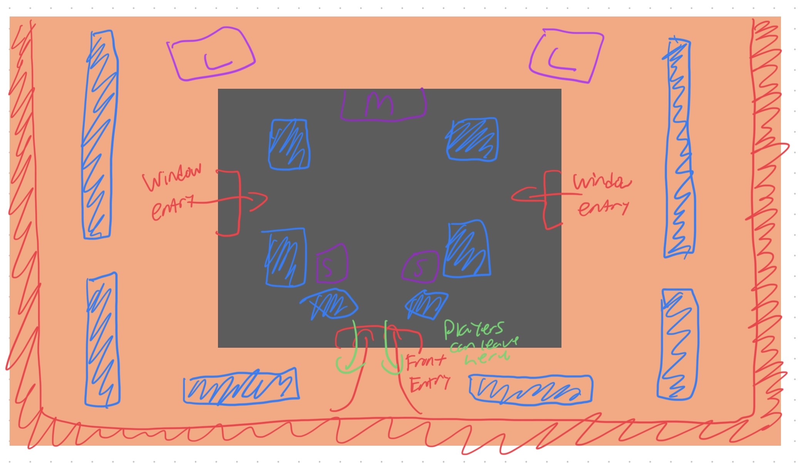
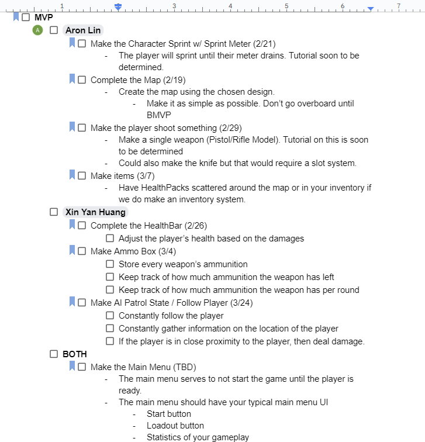
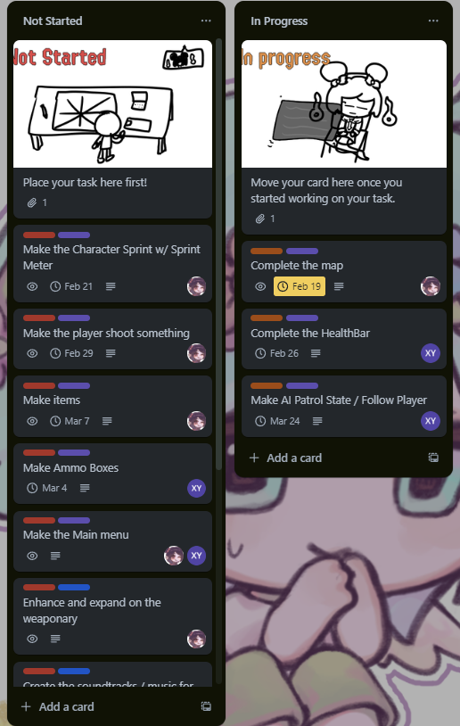
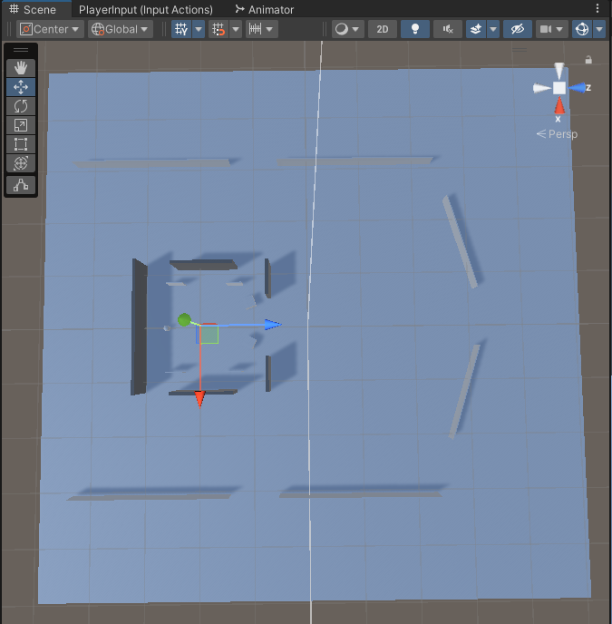
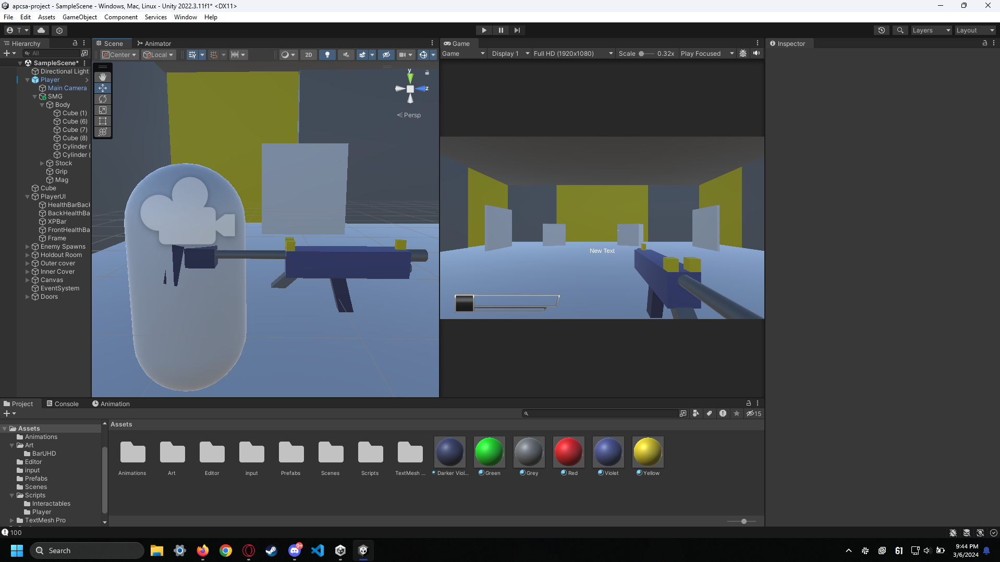
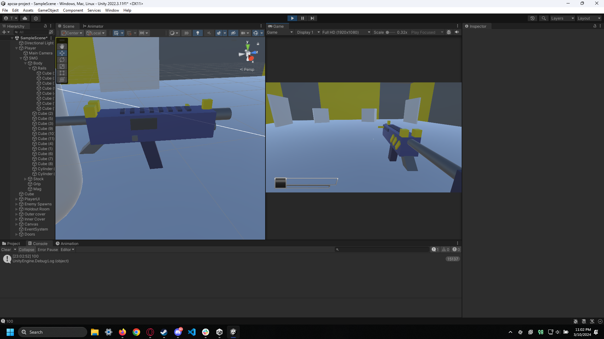

# Tool Learning Log

Tool: **Undecided**

Project: **Player Vs Environment First Person Shooter**

---

### 9/28/2023:
* Made a Trello Board for me and Xin Yan to keep track on our progress

### 10/29/2023:
* Started tinkering with Unity
* Learned how to [navigate through](https://learn.unity.com/tutorial/explore-the-unity-editor-1#) the Unity Editor
    * Learned how to navigate throuigh the camera view
    * Also learned how to manipulate shape (I.e Scaling,Moving,Rotating,etc)

### 11/4/2023:

Mega hiatus due to workload but I am back
* Started tinkering with Godot
    * Similar to Unity, I tried to navigate through the menu, checking guides , and modifying shapes.
    * Godot on documentation seems a bit lackluster compared to Unity. Unity gives you full indepth documentation for beginners while Godot feels lacking. It is trying to tell me what this is suppose to do but I'm often confused what am I'm supposed to do. Maybe I am doing it wrong?

### 11/13/2023:

* Calendar sync with Trello established
* Linked tutorials on C# tutorials and linked basic Unity tutorial projects
* Learned C# with this [youtube tutorial](https://www.youtube.com/watch?v=IFayQioG71A)
    * Learned its almost but nearly idential to java.

### 11/26/2023:
* Complted the C# tutorial
* Started a sample project for the FPS game before moving on to the main game. Will be using this [tutorial](https://www.youtube.com/watch?v=rJqP5EesxLk&list=PLGUw8UNswJEOv8c5ZcoHarbON6mIEUFBC&index=1)
* Created the cards to start the sample project before moving on to the main project
* Began the sample project by following the tutorial on the link at **11/26/2023**
    * Created a player capsule and setting the camera position to 0 , 0.6 , 0
    * Downloaded the input system

### 11/30/2023
* Nothing much really happened aside from Trello Board updating to make it more presentable.

### 12/2/2023
* Made the input system.
    * This was accomplished by making the input folder in the asset folder followed by creating the "Input Actions" and naming it PlayerInput.
    * By using the actionmap, I was able to make movement for both keyboard and controller by using the 2D Vector Composite
        * NOTE: There wasn't a "Add 2D Vector Composite option" in the Actions tab. The workaround for this was to set the Action type to "Value" then the Control Type to "Vector 2". Then you will see the option but renamed to "Add Up/Down/Left/Right Composite" .
        * The source is listed [here](https://www.reddit.com/r/Unity3D/comments/s5t1bs/unity_isnt_showing_the_add_2d_vector_composite/). Thank goodness!
    * Added the C# File named PlayerInput in the input folder.
    * Made some flooring and some blocks for the player to jump at.

### 12/3/2023
* Little configuration to make sure Unity targets VScode instead of VSeditor.
* Created the inputManager Code
    * You can check it out [here](codesnippits/inputmanagersnippit.cs)
        * There seems to be an error on lines 11 to 13 saying "The type or namespace name 'PlayerMotor' could not be found (are you missing a using directive or an assembly reference?)". Will check it out later.
* Created the PlayerMotto code.
    * You can check it out [here](codesnippits/playermansnippit.cs)

### 12/4/2023
* Fixed the error related to the PlayerMotor
    * I named PlayerMotor to PlayerMotto and that caused the issue LOL

### 12/5/2023
* Learned about the input debugger
    * This ensures that the game is officially sending in the right inputs
* Encountered a bug related to the onEnable and onDisable
    * I do not know what could've caused this so I've asked the Natty GameDev Discord Community. I haven't gotten a response yet but it might take a while.
    * Retraced my steps and learned that in the inputmanager, I have to change `void Start` to `void Awake` on my own.

### 12/10/2023
* Added gravity
    * This is done by adding the following code in the PlayerMotor...
    ```cs
    private bool isGrounded;
    public float gravity = -9.8f;
    void Update()
    {
        isGrounded = controller.isGrounded;
    }
    playerVelocity.y += gravity * Time.deltaTime;
    if(isGrounded && playerVelocity.y < 0){
        playerVelocity.y = -2f;
    }
    controller.Move(playerVelocity * Time.deltaTime);
    Debug.Log(playerVelocity.y);

    ```
* Added the jump function.
    * Made another method called jump in the PlayerMotor
    ```cs
    public void Jump(){
        if(isGrounded){
            playerVelocity.y = Mathf.Sqrt(jumpHeight * -3.0f * gravity);
        }
    }
    ```
    then assign it to the input manager
    ```cs
    onFoot.Jump.performed += ctx => motor.Jump();
    ```
* Added the ability for the player to look around.
    * Here is the [main code](codesnippits/playerlooksnippit.cs) but there were adjustments made to the playerMotor and InputManger for the newly added playerlook code.

## 12/11/2023
* Getting ready for Video 2
    * Making an interactable door.

## 12/18/2023
* Finished the interactable door model.

## 12/25/2023
* Started watching Video 2
* Made interactable scripts using the keypad I built using the door model
    * There are multiple scripts that go into the interactable but the common one being that you need the [playerInteract](codesnippits/playerinteractsnippit.cs) and [playerUI](codesnippits/playeruisnippit.cs) script.
    * The [keypad](codesnippits/keypadsnippit.cs) requires a seperate script but it is always inheriting one of the scripts.
    * Animated the door and changed some scripts.
        * Several variable changes but had to make some public so that other files can recognize.
        * Here is the [door demo](codesnippits/demo1.mp4)!

## 12/27/2023
* Started watching Video 2.5
    * This is basically interactions but made easier for smaller things

## 1/8/2024
NEW YEAR! WHOOOOOO!!!

* Prepping for a main Github repo for our main project.
    * Since me and Xin Yan didn't finish all the tutorials, all tutorials going forward will get directed towards the main project.
    * Will take some time to setup since Xin Yan doesn't have WSL installed on her computer.

## 1/22/2024
This is another major heitis but we are back!

* Created the repo for our [main project](https://github.com/aronl9810/apcsa-project-aron-xinyan)
    * This is where me and Xin Yan will collab in one repo.
* Helped setup Xin Yan VScode editor on her computer
    * This is done using the same method (Installing WSL and following Muellers VScode setup)
* Planned out future goals
    * You can see here! 

## 1/24/2024
* Started 2 initial sketches of the map design
    * 
    * 
    * Currently awaiting Xin Yan's feedback but until then, working on importing the character data from the sample project.

## 1/25/2024
* Imported the sample project to the main project
    * This is to save time on rebuilding the character data again.

## 2/5/2024
* Started working on the map

# 2/12/2024
* Started our MVP planning progress.
    * This is where Mueller assigned us what are we gonna do to make our product minimally viable.

# 2/13/2024
* Continued planning what we are gonna do for our MVP.
    * Here is our current plan as of this moment
    * 

# 2/14/2024
* Imported the MVP/BMVP plans to the trello board.
    * 

# 2/18/2024
* Continued working on the map
    * Removed the interactable door (For now)
    * During this day, it is almost complete but here is the result.
    * 

# 2/22/2024
* Added the sprint functionality
    * The sprint functionality from Natty's Gamedev video only allows you to sprint if you only click on the sprint key. However, I wanted the plauer to hold down the shift key to sprint and once they release it, they stop sprinting.
        * To accompish this, I've messed around with the code a bit and this is what I've came out.
```cs
    void Update()
    {
        isGrounded = controller.isGrounded;
        if(sprinting){
            if(Input.GetKey(KeyCode.LeftShift)){
                speed = 10f;
            } else {
                speed = 5f;
                sprinting = false;
            }
        }
    }
    // ...

    public void Sprint(){
        sprinting = !sprinting;
    }
```

# 2/26/2024
* Sick so missed a MVP work day x_x

# 3/4/2024
We are heading into March!!!

* Relocated the dates for the projects
    * Due to how busy me and Xin Yan have been, the following dates were changed to the following
        * Make the player shoot was moved to Mar/16
        * Make items was moved to Mar/30
        * AI Patrol State / Follow Player was moved to Mar/24
        * Ammo boxes were moved to Apr/6
        * Main Menu now has a deadline which is Apr/20

# 3/6/2024

* Worked and finished a simple gun model
    * Coding the gun hasn't begun but wanted to make this model as a start
    * 

# 3/8/2024

* Polished and finished the gun model
    * Took a bit but its here!
    * 

# 3/11/2024

* Blog #4 writing
    * Progress can be seen [here](https://github.com/aronl9810/apcsa-freedom-project/commit/9c53f0c8c3ae6f0a00860aa848ea3298321706e1)

# 3/12/2024

* Blog #4 writing part 2
    * Progress can be seen [here](https://github.com/aronl9810/apcsa-freedom-project/commit/444dc5ffc1044b7e0f3048c05211133b5b6385f2)

<!--
* Links you used today (websites, videos, etc)
* Things you tried, progress you made, etc
* Challenges, a-ha moments, etc
* Questions you still have
* What you're going to try next
-->
